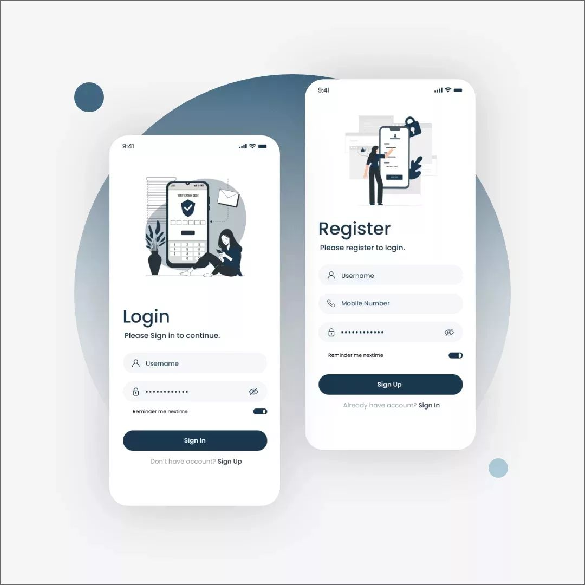

# Flutter Login and Registration UI

This Flutter project features a modern and clean design for a login and registration interface. The design is user-friendly, intuitive, and visually appealing, providing a seamless experience for users.
Key Features:

    Login Screen:
        A welcoming screen prompting users to sign in.
        Fields for entering username and password.
        Option to toggle password visibility.
        A "Remember me next time" switch for easier access.
        A "Sign In" button for logging in.
        A link to navigate to the registration screen for new users.

    Registration Screen:
        A prompt for users to register an account.
        Fields for entering username, mobile number, and password.
        Option to toggle password visibility.
        A "Remember me next time" switch for convenience.
        A "Sign Up" button for creating a new account.
        A link to navigate back to the login screen for existing users.

## Design Highlights

    Visual Appeal: The design utilizes a minimalist approach with a soft color palette, ensuring the UI is not only functional but also aesthetically pleasing.
    User-Friendly: Clear labels and intuitive layout make it easy for users to navigate and interact with the app.
    Consistency: Both screens maintain a consistent style, providing a cohesive user experience.

### Screenshot

